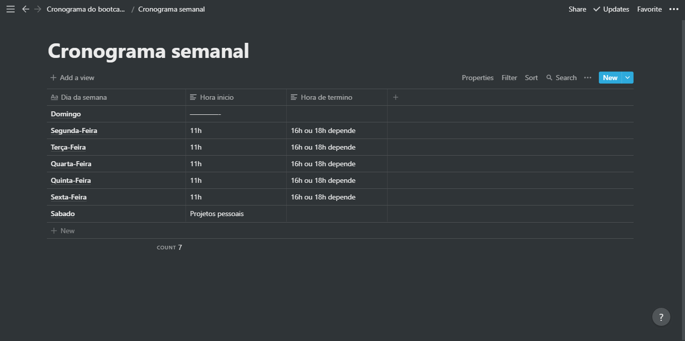
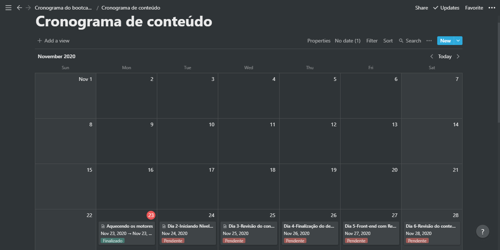

<h3 align="center">
  Desafio 1: Planejando meus estudos
</h3>

<blockquote align="center">“Sua única limitação é você mesmo”!</blockquote>

  

  

  

  

  <a href="#rocket-sobre-o-desafio">Sobre o desafio</a>&nbsp;&nbsp;&nbsp;|&nbsp;&nbsp;&nbsp;
  <a href="#calendar-entrega">Entrega</a>&nbsp;&nbsp;&nbsp;|&nbsp;&nbsp;&nbsp;
  <a href="#memo-licença">Licença</a>

## :rocket: Sobre o desafio

Nesse desafio, você deve planejar os seus estudos.

Para isso, você deve criar um cronograma que irá se adaptar ao seu tempo e ritmo.

Defina qual será seu horário de estudo, criando tarefas que estarão atreladas a um calendário, para se manter com foco e sempre alinhado com seus objetivos!

Agora você deve planejar suas tarefas diárias para que você consiga estar preparado para todo o conteúdo que irá consumir durante a semana.

Aqui você pode seguir o modelo disponibilizado abaixo para criar seu próprio calendário de estudos, para que você consiga sempre se manter organizado e focado nos seus objetivos.

📄 **[Link para o modelo feito](https://www.notion.so/Cronograma-do-bootcamp-4f6ab3da30eb4aa995562e002f5c0b79)**

### Definindo o cronograma semanal

  

Nessa sessão você deve informar os horários fixos que você irá se dedicar durante a sua jornada como programador, afinal, a rotina de estudos será o primeiro passo para você conseguir atingir os seus objetivos o mais rápido possível!

### Definindo o cronograma diário

  

## :memo: Licença

Esse projeto está sob a licença MIT. Veja o arquivo [LICENSE](../LICENSE) para mais detalhes.

---

Feito com 💜 by Rocketseat :wave: [Entre na nossa comunidade!](https://discordapp.com/invite/gCRAFhc)
